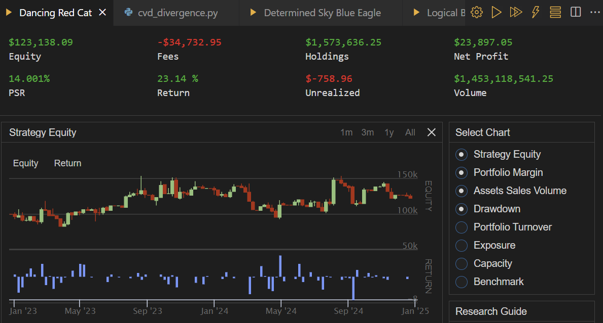

# Quant-Development

Some trading algos I made to backtest for fun on [QuantConnect](https://www.quantconnect.com/)

## CVDDivergenceAlgorithm

Based on the "CVD Divergence Oscilator" indicator on TradingView with additional filters. Trades MES/ES exclusively

Terrible but fun project

Sharpe Ratio: 0.281 💀

Backtest:

